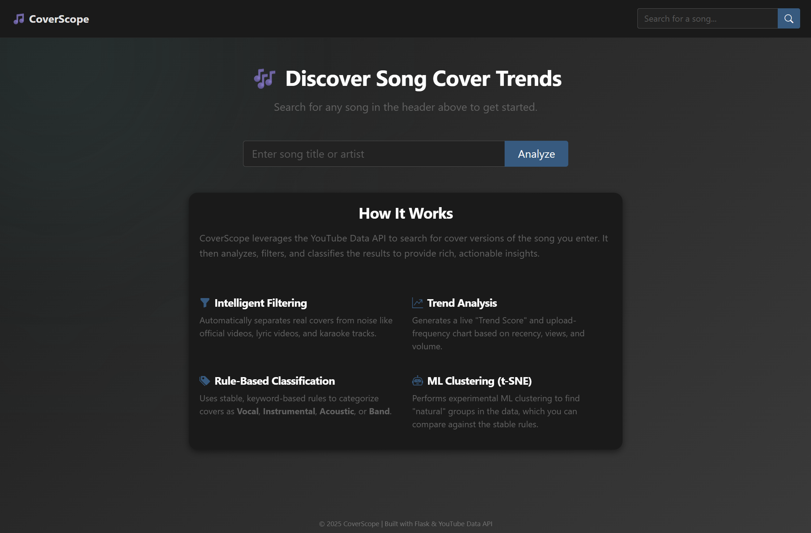
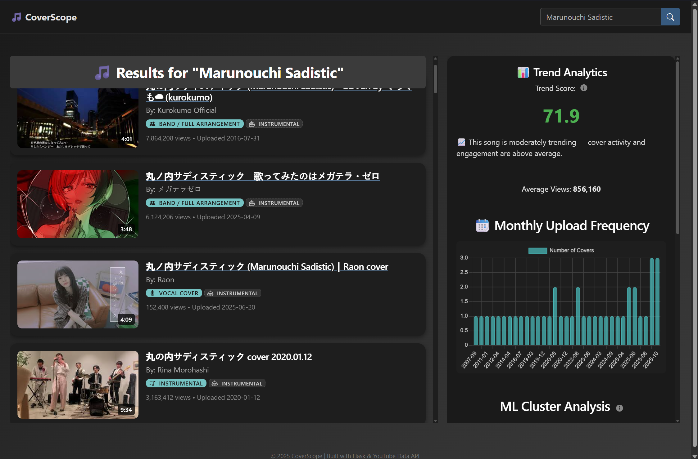

# 🎵 CoverScope - Song Cover Trend Analyzer

CoverScope is a Python Flask web application that provides in-depth trend analysis for song covers on YouTube. Users can search for a song, and the app fetches, filters, and analyzes up to 50 recent covers to provide rich, interactive data visualizations and analytics.





## Features

* **YouTube Data API Integration:** Fetches up to 50 relevant videos, gathering metadata, statistics, and descriptions for analysis.
* **Intelligent Cover Filtering:** A rule-based filter accurately separates real "covers" from "noise" (official videos, lyric videos, karaoke, etc.).
* **Dual Classification System:**
    * **Stable (Rule-Based):** Classifies covers using a fast and reliable set of keywords (e.g., "Vocal", "Instrumental", "Acoustic", "Band").
    * **Experimental (ML-Based):** Uses `scikit-learn` (TF-IDF & KMeans) to perform unsupervised clustering, finding "natural" groups in the video text to compare against the stable rules.
* **Rich Data Visualization:**
    * **Trend Score:** A custom formula calculates a single "Trend Score" based on recency, view count, and volume of covers.
    * **Upload Frequency:** A bar chart visualizes the number of covers uploaded per month.
    * **t-SNE Cluster Plot:** An interactive scatter plot visualizes the high-dimensional ML cluster data in 2D.
* **Detailed Analytics Panel:** Includes Top 3 covers, average view count, and top keywords for each ML cluster.
* **Interactive UI:** Features detailed tooltips (popups) explaining each analytic and feature.

## Tech Stack

* **Backend:** Flask (Python)
* **Frontend:** HTML, CSS, JavaScript (with Chart.js & Bootstrap 5)
* **API:** YouTube Data API v3
* **Data Science:** Scikit-learn, Numpy
* **Deployment:** Gunicorn (for Render)

## How to Run Locally

1.  **Clone the repository:**
    ```bash
    git clone [your-repo-url]
    cd [your-repo-name]
    ```

2.  **Create and activate a virtual environment:**
    ```bash
    python -m venv venv
    source venv/bin/activate  # (on Mac/Linux)
    .\venv\Scripts\activate   # (on Windows)
    ```

3.  **Install dependencies:**
    ```bash
    pip install -r requirements.txt
    ```

4.  **Create your environment file:**
    * Create a new file in the root folder named `.env`
    * Add your YouTube API key to it:
    ```
    YOUTUBE_API_KEY=YourSecretApiKeyHere
    ```

5.  **Run the app:**
    ```bash
    flask run
    ```
    The app will be available at `http://127.0.0.1:5000`.
